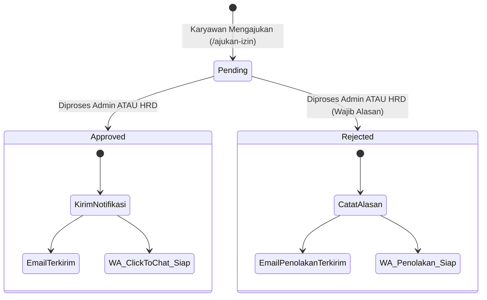
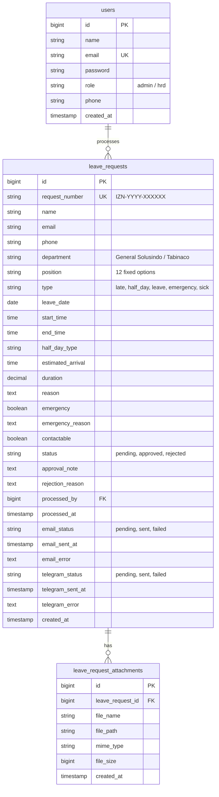

# Website CRUD Izin Kantor — General Solusindo

[](https://laravel.com)
[](https://php.net)
[](https://tailwindcss.com)
[](https://alpinejs.dev)
[](https://core.telegram.org/bots/api)
[-success?style=for-the-badge)](tests)

Sistem aplikasi web internal pengajuan dan persetujuan izin kantor untuk **General Solusindo** dan **Tabinaco**. Dirancang khusus sebagai pengganti Google Forms dengan arsitektur formulir dinamis satu pintu, validasi otomatis berbasis jam kerja kantor (WIB), *single-step approval*, proteksi konkurensi atomic row-lock, notifikasi multi-kanal (Notifikasi Telegram Instan ke HRD/Admin, Email Konfirmasi, & WhatsApp Click-to-Chat), pelaporan statistik, serta ekspor CSV teroptimasi spreadsheet.

---

## Daftar Isi
- [1. Arsitektur & Prinsip Desain](#1-arsitektur--prinsip-desain)
- [2. Spesifikasi Aturan Bisnis (5 Jenis Izin)](#2-spesifikasi-aturan-bisnis-5-jenis-izin)
- [3. Standarisasi Jabatan / Divisi (12 Opsi)](#3-standarisasi-jabatan--divisi-12-opsi)
- [4. Alur Notifikasi Telegram HRD/Admin](#4-alur-notifikasi-telegram-hrdadmin)
- [5. Alur Kerja Persetujuan (Approval Workflow)](#5-alur-kerja-persetujuan-approval-workflow)
- [6. Keamanan & Perlindungan Data](#6-keamanan--perlindungan-data)
- [7. Skema & Model Database](#7-skema--model-database)
- [8. Mesin Pelaporan & Ekspor CSV](#8-mesin-pelaporan--ekspor-csv)
- [9. Peta Rute & Hak Akses (Route Matrix)](#9-peta-rute--hak-akses-route-matrix)
- [10. Panduan Instalasi & Menjalankan](#10-panduan-instalasi--menjalankan)
- [11. Akun Default Pengujian (Seeder)](#11-akun-default-pengujian-seeder)
- [12. Pengujian Otomatis (Automated Testing)](#12-pengujian-otomatis-automated-testing)
- [13. Standar Kode & Pemeliharaan](#13-standar-kode--pemeliharaan)

---

## 1. Arsitektur & Prinsip Desain

### 1.1 Karyawan Tanpa Akun (*Zero-Friction Submission*)
* Karyawan **TIDAK memiliki akun**, **TIDAK perlu login**, dan **TIDAK memiliki dashboard/profil**.
* Pengajuan dilakukan melalui satu formulir publik dinamis berbasis Alpine.js di `/ajukan-izin`.
* Data identitas pengaju (*Nama, Email, No. WhatsApp, Departemen, Jabatan*) dicatat sebagai snapshot pada setiap pengajuan untuk menjaga integritas data riwayat.
* Setiap pengajuan menghasilkan **Nomor Pengajuan Unik** terenkapsulasi dengan format `IZN-YYYY-XXXXXX` (contoh: `IZN-2026-000001`).
* Karyawan dapat memantau status secara mandiri di `/cek-status` menggunakan verifikasi ganda nomor pengajuan dan email.

### 1.2 Pemisahan Tanggal Pengajuan vs Tanggal Pelaksanaan Izin
* `created_at` digunakan khusus sebagai catatan waktu pengiriman formulir (*timestamp submission*).
* `leave_date` digunakan khusus sebagai tanggal pelaksanaan izin yang diajukan. Seluruh aturan bisnis masa tunggu (**H-1**, **H-7**, dan batas jam kerja) dihitung terhadap `leave_date` relatif terhadap tanggal pengiriman.

### 1.3 Hak Akses 2-Role (Admin & HRD)
* Hanya terdapat 2 role login internal:
  1. **`admin`**: Role privilege tertinggi. Memiliki akses ke Dashboard Admin eksklusif (`/admin/dashboard`), seluruh menu operasional, riwayat, dan laporan.
  2. **`hrd`**: Role peninjau operasional. Memiliki akses ke Dashboard HRD eksklusif (`/hrd/dashboard`), daftar pengajuan, riwayat, dan laporan.
* Dashboard Admin dan HRD dipisahkan secara ketat menggunakan route middleware (`role:admin` dan `role:hrd`).

---

## 2. Spesifikasi Aturan Bisnis (5 Jenis Izin)

Seluruh validasi waktu mengacu pada zona waktu resmi kantor: **WIB (`Asia/Jakarta`)**. Jam kerja operasional kantor dimulai pukul **08.30 WIB**.

| Jenis Izin | Slug Internal | Syarat Tanggal (`leave_date`) | Batas Waktu Submit | Syarat Kondisi Darurat (*Emergency*) | Syarat Dokumen Pendukung |
|---|---|---|---|---|---|
| **Izin Terlambat** | `late` | Wajib Hari H (`today`) | Normal: &le; 07.00 WIB | Lewat 07.00 WIB: **Wajib Darurat** + Alasan Darurat | Opsional |
| **Izin Setengah Hari** | `half_day` | Minimal **H-1** (mulai besok) | - | - | Opsional |
| **Cuti** | `leave` | Minimal **H-7** | - | - | Opsional |
| **Izin Darurat** | `emergency` | Wajib Hari H (`today`) | Maksimal **08.30.00 WIB** | Tipe izin inheren darurat (*Alasan wajib*) | Opsional |
| **Izin Sakit** | `sick` | Hari H atau tanggal mendatang | Normal: < 08.30 WIB | Hari H &ge; 08.30 WIB: **Wajib Darurat** + Alasan Darurat | **Wajib** surat dokter jika > 1 hari |

### Detail Aturan Spesifik:
1. **Izin Terlambat (`late`)**:
   - Hanya dapat diajukan untuk tanggal hari ini.
   - Jam masuk kantor adalah **08.30 WIB**. Estimasi kedatangan maksimal yang diperbolehkan adalah **09.30 WIB**.
   - Jika diajukan setelah pukul **07.00 WIB**, kolom `emergency` wajib dicentang dan `emergency_reason` wajib diisi.
   - Pernyataan persetujuan konsekuensi wajib disetujui.
2. **Izin Setengah Hari (`half_day`)**:
   - Wajib diajukan minimal H-1 sebelum tanggal izin.
   - Durasi dihitung secara otomatis dari `start_time` dan `end_time` (standar kerja sekitar ±4 jam). Jika durasi terpaut jauh (< 3 jam atau > 5 jam), formulir menampilkan peringatan tinjauan khusus.
   - Wajib memilih jenis: *Datang terlambat*, *Pulang lebih awal*, atau *Keluar kantor sementara*.
3. **Cuti (`leave`)**:
   - Wajib diajukan minimal H-7 dari tanggal pengajuan untuk keperluan koordinasi delegasi pekerjaan.
   - Durasi dihitung dalam satuan hari kalender.
4. **Izin Darurat (`emergency`)**:
   - Menggantikan izin pribadi reguler.
   - **Hanya dapat diajukan untuk Hari H** (`today` Asia/Jakarta). Tidak ada pengajuan mundur maupun tanggal mendatang.
   - **Batas waktu submit maksimal pukul 08.30.00 WIB**. Pengajuan pada `08:30:01` WIB ke atas otomatis ditolak oleh validasi server.
   - Alasan kondisi darurat wajib diisi.
   - Tidak memerlukan checkbox darurat terpisah karena tipe izin ini secara inheren merupakan izin darurat.
5. **Izin Sakit (`sick`)**:
   - Jam kerja resmi dimulai pukul **08.30 WIB**.
   - Pelaporan pada hari H sebelum 08.30 WIB diproses sebagai izin sakit normal.
   - Pelaporan pada hari H pada atau setelah 08.30 WIB wajib menandai kondisi darurat beserta alasannya.
   - Jika estimasi istirahat **lebih dari 1 hari**, surat keterangan dokter **wajib diunggah**.
   - Jika sakit 1 hari tanpa bukti medis, sistem memberikan penanda kebijakan kantor kepada Admin/HRD bahwa izin tersebut dapat dievaluasi sesuai ketentuan internal perusahaan.
   - Karyawan wajib memilih opsi kesediaan dihubungi (*contactable*) untuk koordinasi darurat.

---

## 3. Standarisasi Jabatan / Divisi (12 Opsi)

Untuk menjaga konsistensi database dan akurasi pelaporan, input teks bebas jabatan digantikan dengan dropdown wajib (*allow-list validation*) berisi 12 opsi resmi:

1. `Sales`
2. `Marketing`
3. `Finance`
4. `Operasional`
5. `Procurement`
6. `Teknisi`
7. `Internship`
8. `Admin Store`
9. `Content Creator`
10. `HR`
11. `Digital Merketing`
12. `SI Officer`

Nilai yang tidak terdaftar dalam allow-list di atas akan ditolak langsung oleh validasi server.

---

## 4. Alur Notifikasi Telegram HRD/Admin

Setiap kali pengajuan izin baru berhasil dibuat dan berstatus `pending`, sistem secara otomatis mengirimkan notifikasi instan ke grup Telegram internal HRD & Admin.

```
Karyawan Mengisi Form
        ↓
Validasi Form Sukses
        ↓
DB Transaction: Buat Leave Request (Status: Pending)
        ↓
Commit DB Transaction
        ↓
Panggil TelegramNotificationService
   ├── Sukses: telegram_status = 'sent', telegram_sent_at tercatat
   └── Gagal:  telegram_status = 'failed', telegram_error tercatat (DB TIDAK di-rollback)
        ↓
Tampilkan Halaman Sukses ke Karyawan
```

### 4.1 Prinsip Keamanan & Desain Notifikasi
* **Strict Post-Commit**: Telegram dipanggil strictly **setelah** transaksi database di-commit.
* **Fail-Safe Integrity**: Kegagalan koneksi atau API Telegram **tidak menggagalkan** penyimpanan izin. Data pengajuan tetap aman berstatus `pending`.
* **Proteksi Duplikasi**: Notifikasi hanya dikirim pada *event* POST submission. Me-refresh halaman sukses (`GET /pengajuan/sukses/{number}`) tidak akan memicu pengiriman ulang notifikasi.
* **Production CTA URL**: Tombol `Lihat Pengajuan` menggunakan `APP_URL` environment (format: `{APP_URL}/pengajuan/{id}`) dan tetap terlindungi oleh otentikasi login staf WebApp.
* **Zero Leak**: Pesan Telegram tidak membocorkan data rahasia seperti file path internal, password, atau isi rekam medis detail. Karakter HTML disanitasi menggunakan `htmlspecialchars`.

---

## 5. Alur Kerja Persetujuan (Approval Workflow)



### 3.1 Keputusan Final Satu Tahap (*Single-Step Approval*)
* Tidak ada eskalasi berjenjang (tidak memerlukan persetujuan bertingkat HRD &rarr; Admin).
* Satu tindakan persetujuan oleh salah satu staf berwenang (**Admin ATAU HRD**) langsung mengubah status menjadi permanen (`approved` atau `rejected`).
* Penolakan pengajuan **wajib** menyertakan alasan penolakan tertulis (`rejection_reason`).
* Persetujuan pengajuan mendukung catatan opsional (`approval_note`).

### 3.2 Proteksi Konkurensi Database (*Row-Level Lock*)
* Menggunakan `DB::transaction` dan Eloquent `lockForUpdate()`.
* Mencegah *race condition* atau inkonsistensi data jika dua staf membuka dan memproses pengajuan yang sama pada detik yang bersamaan.

### 3.3 Notifikasi Multi-Kanal Fail-Safe
* **Email Otomatis**:
  - Dikelola oleh Laravel Mailable (`LeaveRequestApprovedMail` & `LeaveRequestRejectedMail`).
  - Dilengkapi pelacakan status email di database (`email_status`: `pending`, `sent`, `failed`).
  - Kegagalan server SMTP pihak ketiga ditangkap (*try-catch*) sehingga **tidak menggugurkan** status persetujuan yang telah tersimpan di database.
* **WhatsApp Click-to-Chat (`wa.me`)**:
  - Sistem membuat tautan langsung `https://wa.me/{nomor_normalisasi}?text={pesan_otomatis}`.
  - Reviewer cukup menekan tombol "Kirim via WhatsApp" pada layar detail pengajuan untuk membuka chat WhatsApp resmi yang sudah terisi format teks keputusan lengkap.

---

## 6. Keamanan & Perlindungan Data

1. **Proteksi Dokumen Lampiran Privat**:
   - Seluruh dokumen surat dokter dan berkas pendukung disimpan pada direktori penyimpanan privat (`storage/app/private/attachments/{id}`).
   - Berkas tidak dapat diakses secara publik via URL statis. Pengunduhan dokumen melalui endpoint terproteksi (`/pengajuan/{id}/attachment/{attachment_id}`) dengan verifikasi otentikasi login staf.
2. **Pencegahan Penyalahgunaan Endpoint Publik (*Rate Limiting*)**:
   - `POST /ajukan-izin`: Dibatasi **30 requests/menit/IP** (`throttle:30,1`) agar beberapa karyawan yang menggunakan IP/Wi-Fi kantor bersama tidak saling ter-throttle.
   - `POST /cek-status`: Dibatasi **10 requests/menit/IP** (`throttle:10,1`).
   - `POST /login`: Dibatasi **10 requests/menit/IP** (`throttle:10,1`) untuk perlindungan brute-force.
3. **Sanitasi Data Cek Status**:
   - Pengecekan status di `/cek-status` mewajibkan kombinasi cocok antara Nomor Pengajuan dan Alamat Email Pribadi.
   - Data yang dikembalikan kepada publik disanitasi (tidak menampilkan data sensitif internal seperti ID database, email pengirim, atau rincian sistem).
4. **Validasi File Upload Ketat**:
   - Batasan format berkas: `pdf`, `jpg`, `jpeg`, `png`.
   - Batasan ukuran maksimum berkas: **5 MB**.

---

## 7. Skema & Model Database



---

## 8. Mesin Pelaporan & Ekspor CSV

Halaman `/laporan` menyediakan ringkasan analitik dan distribusi permohonan izin dengan fitur:
* **Filter Rentang Waktu**: Menyaring data berdasarkan **`leave_date`** (*Dari Tanggal* s/d *Sampai Tanggal*).
* **Tabel Rincian Data**: Menampilkan data pengajuan yang masuk dalam filter secara visual sebelum diunduh.
* **Ekspor CSV Teroptimasi Spreadsheet**:
  - **UTF-8 BOM Header**: Menjamin karakter khusus terbaca sempurna saat dibuka langsung di Microsoft Excel, Google Sheets, atau LibreOffice.
  - **Proteksi Notasi Ilmiah Nomor HP**: Nomor telepon/WhatsApp diformat khusus menggunakan formula teks (`="628..."`) sehingga Excel tidak mengubahnya menjadi format eksponensial (`6.28E+11`).
  - **Format Tanggal Rapi**: Menggunakan standar ringkas (`dd/mm/yyyy` dan `dd/mm/yyyy HH:ii`) agar kolom tidak menampilkan error overflow tanda pagar (`########`).
  - **Satuan Durasi Jelas**: Nilai durasi otomatis dilengkapi unit (`Jam` untuk setengah hari, `Hari` untuk cuti/sakit/darurat).
  - **Pemisahan Kolom Transparan**: Kolom alasan pengaju dan catatan keputusan reviewer dipisahkan secara tegas (`Keterangan / Alasan Izin` vs `Catatan Keputusan HRD/Admin`).

---

## 9. Peta Rute & Hak Akses (Route Matrix)

| Method | Endpoint / URI | Nama Route | Middleware / Akses | Deskripsi |
|---|---|---|---|---|
| `GET` | `/` | - | Publik | Redirect otomatis ke form pengajuan |
| `GET` | `/ajukan-izin` | `public.form` | Publik | Formulir dinamis pengajuan izin kantor |
| `POST` | `/ajukan-izin` | `public.store` | Publik (`throttle:30,1`) | Validasi, simpan pengajuan & trigger notifikasi |
| `GET` | `/pengajuan/sukses/{request_number}` | `public.success` | Publik | Halaman konfirmasi sukses pengajuan |
| `GET` | `/cek-status` | `status.index` | Publik | Formulir pelacakan status mandiri |
| `POST` | `/cek-status` | `status.check` | Publik (`throttle:10,1`) | Pemeriksaan status pengajuan |
| `GET` | `/login` | `login` | Guest | Halaman login internal Admin / HRD |
| `POST` | `/login` | `login.post` | Guest (`throttle:10,1`) | Proses otentikasi login staf |
| `POST` | `/logout` | `logout` | Auth | Mengakhiri sesi staf |
| `GET` | `/dashboard` | `dashboard` | Auth | Redirect berbasis role ke dashboard yang sesuai |
| `GET` | `/admin/dashboard` | `admin.dashboard` | Auth, `role:admin` | Dashboard operasional khusus Administrator |
| `GET` | `/hrd/dashboard` | `hrd.dashboard` | Auth, `role:hrd` | Dashboard operasional khusus HRD |
| `GET` | `/pengajuan` | `requests.index` | Auth | Daftar pengajuan dengan filter lengkap |
| `GET` | `/pengajuan/{id}` | `requests.show` | Auth | Detail pengajuan, modal approval, WhatsApp CTA |
| `POST` | `/pengajuan/{id}/approve` | `requests.approve` | Auth | Menyetujui izin (opsional catatan) |
| `POST` | `/pengajuan/{id}/reject` | `requests.reject` | Auth | Menolak izin (wajib alasan penolakan) |
| `GET` | `/pengajuan/{id}/attachment/{attachment_id}`| `requests.attachment` | Auth | Unduh lampiran surat dokter privat |
| `GET` | `/riwayat` | `requests.history` | Auth | Log riwayat seluruh pengajuan izin |
| `GET` | `/laporan` | `reports.index` | Auth | Statistik, distribusi pengajuan & filter data |
| `GET` | `/laporan/export` | `reports.export` | Auth | Streaming download file CSV laporan |
| `GET` | `/profil` | `profile.show` | Auth | Profil staf & data akun |

---

## 10. Panduan Instalasi & Menjalankan

### 10.1 Prasyarat Sistem
* **PHP 8.3** atau versi lebih baru.
* Ekstensi PHP aktif: `pdo`, `pdo_pgsql` / `pgsql` (untuk PostgreSQL), `pdo_sqlite` (untuk tests), `mbstring`, `fileinfo`, `openssl`.
* **Composer 2.x**.
* **Node.js 20+** dan **npm**.

### 10.2 Langkah Instalasi

1. **Clone Repository**:
   ```bash
   git clone <url_repository_anda>
   cd perizinan-kantor
   ```

2. **Install Dependensi Backend & Frontend**:
   ```bash
   composer install
   npm install
   ```

3. **Inisialisasi Environment**:
   ```bash
   cp .env.example .env
   php artisan key:generate
   ```

4. **Konfigurasi Database**:
   * **Opsi A: Database Production PostgreSQL / Supabase**:
     ```env
     DB_CONNECTION=pgsql
     DB_HOST=aws-0-ap-southeast-1.pooler.supabase.com
     DB_PORT=5432
     DB_DATABASE=postgres
     DB_USERNAME=postgres.YOUR_PROJECT_REFERENCE
     DB_PASSWORD=YOUR_STRONG_SUPABASE_PASSWORD
     # DB_SSLMODE=require
     ```
   * **Opsi B: Database Lokal SQLite** (Development / Testing):
     ```env
     DB_CONNECTION=sqlite
     ```
   Jalankan migrasi & seeder awal:
   ```bash
   php artisan migrate --seed
   ```

5. **Konfigurasi Notifikasi Telegram (Wajib untuk notifikasi instan HRD/Admin)**:
   Buat bot baru melalui `@BotFather` di Telegram, masukkan bot ke dalam grup HRD/Admin, lalu catat token dan chat ID pada `.env`:
   ```env
   TELEGRAM_BOT_TOKEN=your_bot_token_from_botfather
   TELEGRAM_CHAT_ID=your_internal_group_chat_id
   ```

6. **Konfigurasi Notifikasi Email (SMTP)**:
   ```env
   MAIL_MAILER=smtp
   MAIL_HOST=smtp.mailtrap.io
   MAIL_PORT=587
   MAIL_USERNAME=your_smtp_username
   MAIL_PASSWORD=your_smtp_password
   MAIL_ENCRYPTION=tls
   MAIL_FROM_ADDRESS="no-reply@kantor.com"
   MAIL_FROM_NAME="General Solusindo"
   ```

7. **Kompilasi Aset Frontend**:
   ```bash
   npm run build
   ```

8. **Jalankan Web Server**:
   ```bash
   php artisan serve
   ```
   Aplikasi siap diakses melalui browser di: **http://localhost:8000**

---

## 11. Akun Default Pengujian (Seeder)

Database seeder secara otomatis menyediakan dua akun peninjau bawaan:

| Role | Email Login | Password Default | Catatan Hak Akses |
|---|---|---|---|
| **Administrator** | `admin@example.com` | `password` | Akses penuh dashboard admin, seluruh pengajuan, approval & laporan |
| **HRD** | `hrd@example.com` | `password` | Akses dashboard HRD, daftar pengajuan, approval & laporan |

> [!IMPORTANT]
> Segera ganti password akun default sebelum melakukan deployment ke server produksi atau publik.

---

## 12. Pengujian Otomatis (Automated Testing)

Aplikasi memiliki rangkaian uji otomatis komprehensif menggunakan PHPUnit dengan basis data in-memory SQLite yang cepat dan terisolasi:

```bash
php artisan test
```

### Isolasi Notifikasi Eksternal

Environment PHPUnit memakai kredensial Telegram dummy dan HTTP client yang di-*fake* secara global. Semua request ke `https://api.telegram.org/*` ditangkap di dalam proses test, sementara request HTTP yang tidak secara eksplisit di-*fake* akan gagal. Dengan demikian, menjalankan `php artisan test` tidak pernah mengirim notifikasi ke grup Telegram production. Test Telegram tetap dapat mengganti respons fake untuk menguji skenario sukses, error API, dan kegagalan koneksi.

### Cakupan Pengujian (40 Tests / 153 Assertions):
- **Otentikasi & Keamanan Akses**: Uji login admin/hrd, proteksi kredensial tidak valid, pembatasan middleware role antar dashboard, proteksi logout, dan rute tamu.
- **Validasi 5 Jenis Izin**: Uji alur pengajuan lengkap untuk izin terlambat (aturan 07.00 WIB & emergency), izin setengah hari (durasi jam & minimal H-1), cuti (minimal H-7), **izin darurat** (aturan batas 08.30 WIB hari H & penolakan tipe lama `personal`), dan izin sakit (aturan jam 08.30 WIB & kewajiban surat dokter > 1 hari).
- **Validasi Standarisasi Jabatan**: Uji penerimaan seluruh 12 opsi allow-list jabatan dan penolakan nilai input jabatan di luar daftar.
- **Notifikasi Telegram**: Uji trigger pengiriman post-commit melalui HTTP fake, proteksi data jika pengiriman gagal (tanpa rollback DB), sanitasi karakter HTML/anti-leak, dan proteksi anti-duplikasi saat refresh halaman sukses.
- **Alur Persetujuan & Konkurensi**: Uji aksi approval dengan catatan, penolakan dengan alasan wajib, row-level lock concurrency, dan pembentukan URL WhatsApp Click-to-Chat.
- **Pelacakan Status Publik**: Uji verifikasi nomor pengajuan + email dan sanitasi respon data.
- **Sistem Laporan & CSV**: Uji query statistik filter tanggal dan integritas format file streaming CSV.

---

## 13. Standar Kode & Pemeliharaan

Proyek ini mengikuti standar format kode resmi Laravel menggunakan **Laravel Pint**:

```bash
# Menjalankan pemformatan kode otomatis
vendor/bin/pint --format agent
```

Optimasi cache untuk lingkungan produksi:
```bash
php artisan config:cache
php artisan route:cache
php artisan view:cache
```
